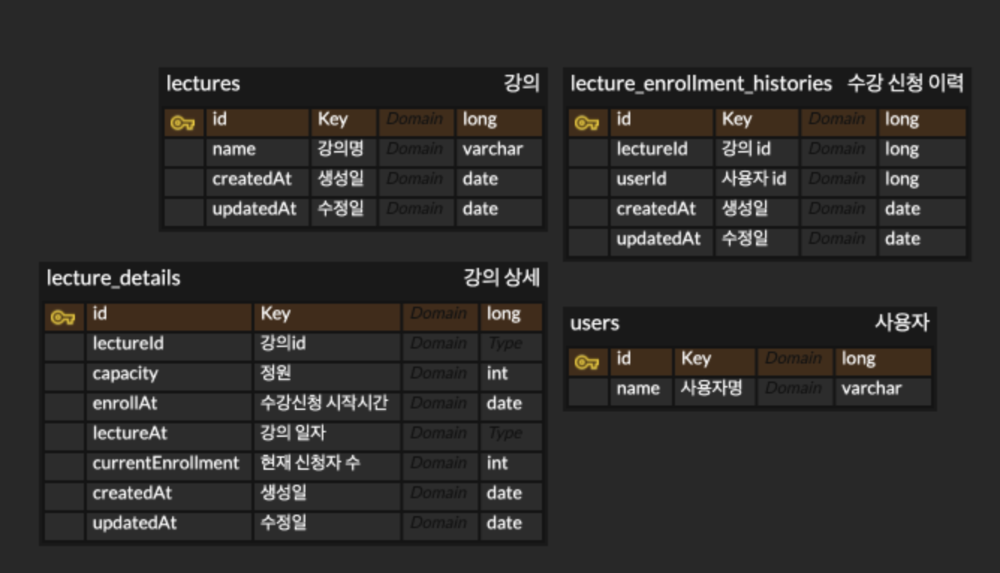

# 클린아키텍처 기반의 멀티 인스턴스 서버 수강 신청 동시성 제어하기

### ERD 개요

### 엔티티 구성

**사용자**

- 간단하게 이름 필드만 존재하도록 구현

**강의**

- 강의명

**강의 상세**

- 강의id
- 수강 정원
- 현재 신청 인원
- 수강 신청 일자
- 강의 일자

**수강 신청 이력**

- 강의id
- 사용자id

### 아키텍처 개요

**domain**

- 비즈니스로직에 사용되는 도메인 엔티티 클래스가 위치

**infrastructure**

- 엔티티 클래스와 데이터베이스 상호작용이 일어나는 계층

**presentation**

- 사용자와 상호작용이 일어나는 계층

\*\*usecase

- 각 도메인의 비즈니스 로직이 실행되는 계층

### 구현 개요

- 수강 신청의 현재 신청자수를 증가시키는 로직의 동시성 제어를 위해 비관적 락을 사용하였습니다.
  - 첫 구현에서는 단순히 순서 제어에 대한 요구사항이 없다고 생각하여, 낙관적 락으로 구현하였으나 수강 신청이라는 요구사항의 특성상 단 시간에 많은 트랜잭션 충돌이 발생할 것으로 예상하여 비관적 락으로 변경하였습니다.
- 각 도메인 엔티티 객체의 속성의 값의 변경이 필요할 경우, 값 변경의 책임은 속성을 가지고 있는 객체 자신이 갖도록 객체지향적으로 구현하였습니다.

### 테스트 코드 구현 여부

- [x] 단위 테스트
- [ ] 통합 테스트
- [ ] e2e 테스트
